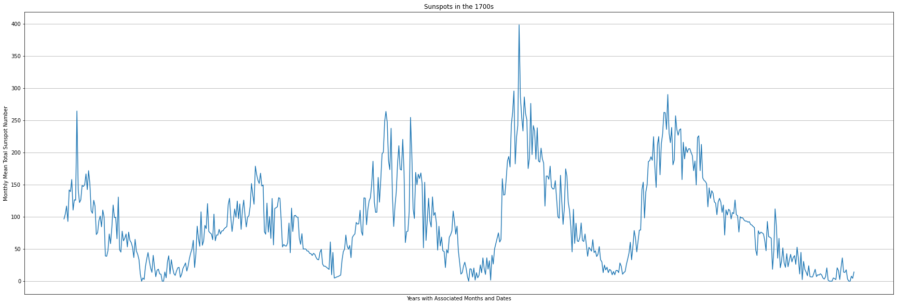
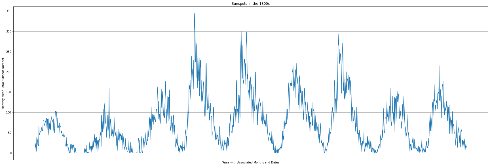
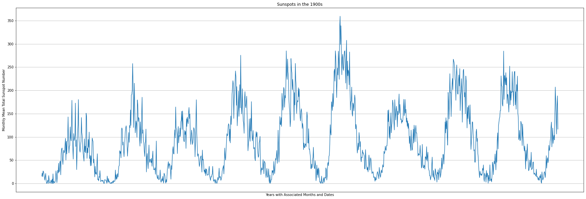
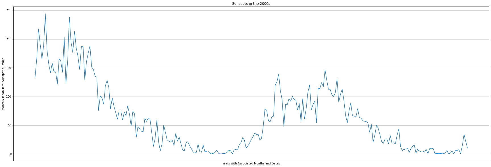

```python
from google.colab import drive
drive.mount('/content/drive')
```

    Mounted at /content/drive
    


```python
import pandas as pd
from numpy import datetime64
import matplotlib.pyplot as plotter


class DataProcessing:
    def __init__(self, var1, var2):
        self.a = var1
        self.b = var2

    def lstprocessing(self):
        yrs = []
        joint = list(map(lambda x, y: [x, float(y)], self.a.iloc[:, 0], self.a.iloc[:, 1]))
        for op in joint:
            if op[0].startswith(self.b[:2]):
                yrs.append(op)
        return yrs

    def plotter(self):
        fig, ax = plotter.subplots(figsize=(30, 10))
        ax.plot(*zip(*DataProcessing.lstprocessing(self)))
        ax.set_xlabel('Years with Associated Months and Dates')
        ax.set_ylabel('Monthly Mean Total Sunspot Number')
        ax.set_title('Sunspots in the %s' % (self.b[:2]+'00s'))
        ax.set_xticks([])
        ax.grid(True)
        plotter.show()

    def statisticalprocessing(self):
        yrs, mmtsn = zip(*DataProcessing.lstprocessing(self))
        yrs = [datetime64(i) for i in yrs]
        yrs_series = pd.Series(yrs)
        mmtsn_series = pd.Series(mmtsn)
        print('A statistical analysis on the years: ')
        print(yrs_series.describe())
        print('A statistical analysis on the Monthly Mean Total Sunspot Number: ')
        print(mmtsn_series.describe())


data = pd.read_csv('/content/drive/MyDrive/Sunspots/Sunspots.csv', usecols=[1, 2])
years = ['1700', '1800', '1900', '2000']
for i in years:
    yrsutl = DataProcessing(data, i)
    yrsutl.plotter()
    yrsutl.statisticalprocessing()

```


    

    


    A statistical analysis on the years: 
    count                     612
    unique                    612
    top       1799-09-30 00:00:00
    freq                        1
    first     1749-01-31 00:00:00
    last      1799-12-31 00:00:00
    dtype: object
    A statistical analysis on the Monthly Mean Total Sunspot Number: 
    count    612.000000
    mean      90.815850
    std       68.994009
    min        0.000000
    25%       35.600000
    50%       77.100000
    75%      128.850000
    max      398.200000
    dtype: float64
    

    /usr/local/lib/python3.7/dist-packages/ipykernel_launcher.py:35: FutureWarning: Treating datetime data as categorical rather than numeric in `.describe` is deprecated and will be removed in a future version of pandas. Specify `datetime_is_numeric=True` to silence this warning and adopt the future behavior now.
    


    

    


    A statistical analysis on the years: 
    count                    1200
    unique                   1200
    top       1867-06-30 00:00:00
    freq                        1
    first     1800-01-31 00:00:00
    last      1899-12-31 00:00:00
    dtype: object
    A statistical analysis on the Monthly Mean Total Sunspot Number: 
    count    1200.000000
    mean       73.022667
    std        62.103360
    min         0.000000
    25%        21.100000
    50%        60.650000
    75%       107.700000
    max       343.800000
    dtype: float64
    

    /usr/local/lib/python3.7/dist-packages/ipykernel_launcher.py:35: FutureWarning: Treating datetime data as categorical rather than numeric in `.describe` is deprecated and will be removed in a future version of pandas. Specify `datetime_is_numeric=True` to silence this warning and adopt the future behavior now.
    


    

    


    A statistical analysis on the years: 
    count                    1200
    unique                   1200
    top       1955-02-28 00:00:00
    freq                        1
    first     1900-01-31 00:00:00
    last      1999-12-31 00:00:00
    dtype: object
    A statistical analysis on the Monthly Mean Total Sunspot Number: 
    count    1200.000000
    mean       90.039417
    std        72.739562
    min         0.000000
    25%        27.900000
    50%        74.200000
    75%       137.450000
    max       359.400000
    dtype: float64
    

    /usr/local/lib/python3.7/dist-packages/ipykernel_launcher.py:35: FutureWarning: Treating datetime data as categorical rather than numeric in `.describe` is deprecated and will be removed in a future version of pandas. Specify `datetime_is_numeric=True` to silence this warning and adopt the future behavior now.
    


    

    


    A statistical analysis on the years: 
    count                     253
    unique                    253
    top       2017-11-30 00:00:00
    freq                        1
    first     2000-01-31 00:00:00
    last      2021-01-31 00:00:00
    dtype: object
    A statistical analysis on the Monthly Mean Total Sunspot Number: 
    count    253.000000
    mean      62.268379
    std       57.964333
    min        0.000000
    25%       10.700000
    50%       48.800000
    75%       97.800000
    max      244.300000
    dtype: float64
    

    /usr/local/lib/python3.7/dist-packages/ipykernel_launcher.py:35: FutureWarning: Treating datetime data as categorical rather than numeric in `.describe` is deprecated and will be removed in a future version of pandas. Specify `datetime_is_numeric=True` to silence this warning and adopt the future behavior now.
    


```python

```
